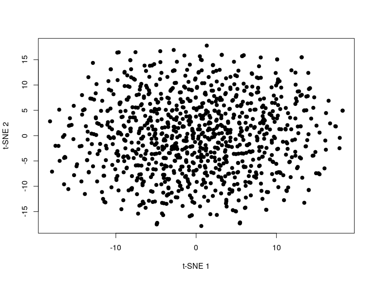
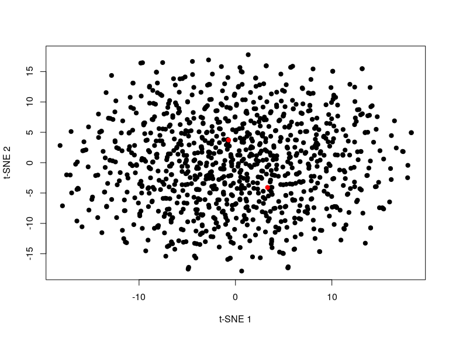

snifter
=======

<!-- badges: start -->

<!-- badges: end -->

R binding for
[openTSNE](https://opentsne.readthedocs.io/en/latest/index.html) using
[basilisk](https://bioconductor.org/packages/devel/bioc/html/basilisk.html).

Example usage
-------------

Basic usage of the function returns a matrix of t-SNE coordinates.

    library("snifter")
    set.seed(42)
    m <- matrix(rnorm(20000), ncol = 20) 
    snifter <- fitsne(m[-(1:2), ], random_state = 42L)
    plot(snifter, pch = 19, xlab = "t-SNE 1", ylab = "t-SNE 2")

We can also project new points into an existing embedding.

    n <- 20
    snifter <- fitsne(m[-(1:n), ], random_state = 42L)
    plot(snifter, pch = 19, col = "black",
        xlab = "t-SNE 1", ylab = "t-SNE 2")
    new <- project(snifter, m[1:n, ], old = m[-c(1:n), ])
    points(new, pch = 19, col = "red")

